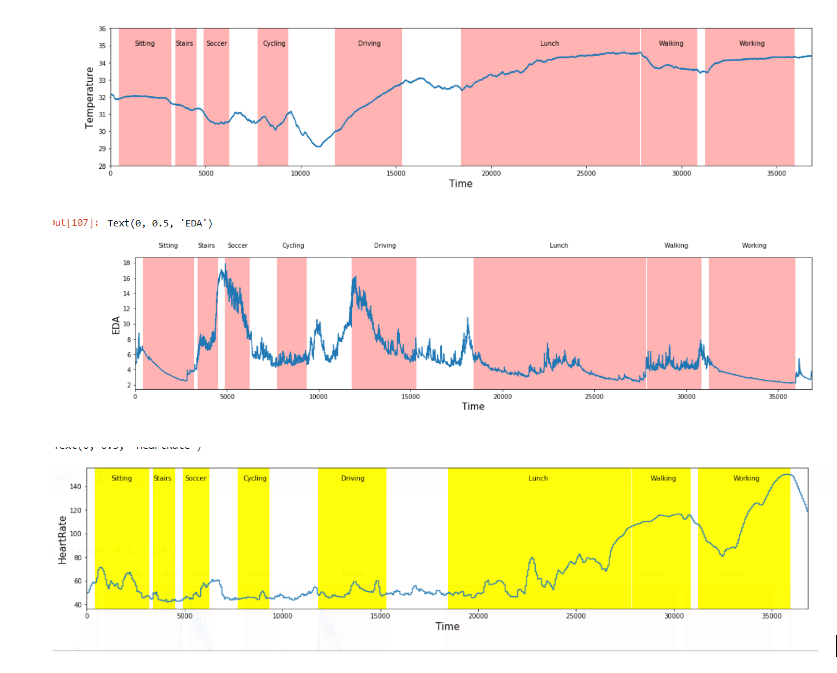

# Activity Classification using Features and ML Model

In this project we used PPG_FIELD dataset which includes 8 activities 
1: "Sitting", 2: "Stairs", 3: "Soccer", 4: "Cycling", 5: "Driving", 6: "Lunch", 7: "Walking", 8: "Working" (For more details: https://archive.ics.uci.edu/ml/datasets/PPG-DaLiA)
We converted the activites to only two lables 0 and 1. 0 includes any activity that doesn't require any movemnet and 1 includes and activity with movemnet. 
Final lables 0: "Sitting", "Lunch", "Working" and 1: "Stairs", "Soccer", "Cycling", "Driving".The dataset includes E4 wristband signals 'ACC_x', 'ACC_y', 'ACC_z', 'TEMP', 'EDA', 'BVP', 'ACC_Magnitude', 'SUBJECT ID', 'Activity'.
- Random Forest classifier is implemented utilizing feature engineering technique.   

# Expected Outcome
